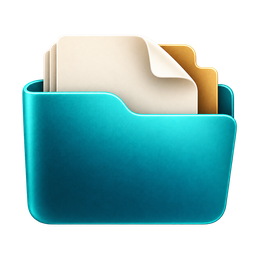

<p align="center"></p>
<h1 align="center">Dossier</h1>
<p align="center"><strong>Your course. Beautifully in order.</strong></p>

Build a complete course-section documentation workspace in seconds. Enter a semester, course, and section; choose a folder; create a perfectly named workspace with your original Word, Excel, HTML, and text templates. Everything stays on your computer.

## Project snapshot

| Detail | Implementation |
|---|---|
| Backend | Rust; exclusive, never-overwrite file creation |
| Desktop | Tauri v2; plain HTML, CSS, JavaScript |
| Templates | 30 originals embedded with rust-embed |
| Interface | Live expandable preview, inline validation, detailed activity log |
| Help | Hover/focus hints throughout; F1 hint mode; tap support |
| Branding | Original transparent PNG, multi-resolution ICO, ICNS |
| Platforms | Windows x64, Linux x64, macOS Intel and Apple Silicon build matrix |
| Current verification | See `verification/` and `docs/VERIFICATION.md` for actual local results |
| Release assets | Each versioned release includes GUI packages and independent standalone CLI packages for Windows x64, Linux x64, macOS Intel, and Apple Silicon, plus SHA-256 checksums. |

## Why this exists

Each new course section starts with the same copying, renaming, and folder setup. Dossier removes that repeated work while preserving the institutional templates exactly. Your marksheet formulas, Word formatting, and existing files remain yours.

## What it creates

The semester folder contains `NAMING CONVENTIONS.txt`, a semester TODO HTML file, and a course-section folder with a course checklist, marksheet, and these categories:

1. Course Outline
2. Attendance Record of the Students
3. Assignment Question
4. Lab Test Questions (Final Term Exam, Lab Tasks, Mid Exam, OBE, Quiz)
5. Project Report
6. Answer Scripts (Highest, Medium, Lowest) of Lab Tests
7. Submitted Copy (Highest, Medium, Lowest) of Assignments
8. Examination Result
9. Lab sheet
10. Assessment criteria or rubrics for assignments or projects or lab-activities
11. CO-PO Files
12. PRINT (All, Merged)

The precise original manifest and golden reference are in [the build dossier](docs/CODEX_BUILD_DOSSIER.md). The application only changes path names, using its four literal substitutions in the specified order. File contents are never parsed or modified.

## Requirements

The executable embeds every template and UI asset; no network is used by the desktop app. Tauri still uses the operating system's webview: **Windows requires Microsoft Edge WebView2 Runtime**, Linux requires WebKitGTK 4.1 and GTK3, and macOS uses its built-in WKWebView. A completely bare Windows image without WebView2 needs that prerequisite provisioned beforehand. The standalone `dossier-cli` can run without a webview.

For source builds: Rust 1.98.1 (pinned in `rust-toolchain.toml`) and the [Tauri native prerequisites](https://v2.tauri.app/start/prerequisites/). No Node/npm build is required for the desktop frontend. The first Cargo build downloads dependencies; subsequent locked, cached builds can run offline.

## How to use

**Windows:** Double-click `dist/Dossier.exe`. `dist/dossier-cli.exe` is the standalone console version. Versioned releases include `dossier-windows-x64.exe` and `dossier-cli-windows-x64.exe`.

```powershell
.\Dossier.exe
```

**Linux GUI:** Extract the `.tar.gz` release, then run the binary on a system with the listed GTK/WebKit dependencies. The separate `dossier-cli-linux-x64.tar.gz` standalone package has no GUI or webview dependency.

```sh
tar -xzf dossier-linux-x64.tar.gz
chmod +x dossier
./dossier
```

**macOS GUI:** Choose Intel or Apple Silicon, extract the `.app.zip`, and open `Dossier.app`. Separate `dossier-cli-macos-intel.tar.gz` and `dossier-cli-macos-apple-silicon.tar.gz` packages contain the standalone CLI. The GUI packages are ad-hoc signed, not Apple-notarized; normal macOS first-run verification applies.

```sh
unzip dossier-macos-apple-silicon.app.zip
open Dossier.app
```

In the app, enter the three details, inspect the live preview, choose an existing output folder, and click **Create workspace**. Press **F1** to highlight hints. Hints are available by hover and keyboard focus without enabling this mode.

## Example

`Fall 25-26` + `DS Lab` + `G` creates:

```text
<chosen folder>/Fall 25-26/
  NAMING CONVENTIONS.txt
  Fall_25-26.TODO_LIST.html
  DS Lab [ G ]/
    Fall_25-26.DS_Lab_[ G ].OVERALL.MARKSHEET.xlsx
    ...12 numbered categories and original templates...
```

CLI automation uses the same Rust engine and prints a JSON activity summary:

```powershell
.\dossier-cli.exe --semester "Fall 25-26" --course "DS Lab" --section "G" --output "E:\Course Files"
```

The GUI executable accepts the same flags. For redirected output and scripts on Windows, use the included console executable `dossier-cli.exe` (GUI executables attach to a parent console only when flags are supplied). Exit codes: 0 success, 1 generation error, 2 argument error.

## Build and verify

```sh
cargo test --locked -p dossier-core
cargo build --locked --release --workspace
python scripts/verify.py
```

Run `cargo run -p dossier` for the desktop app, or `scripts/dev.ps1` on this Windows machine to load the saved Rust environment into the current process. The first build requires native build prerequisites. `cargo fmt --all -- --check` and `cargo clippy --workspace --all-targets -- -D warnings` check formatting and lint.

`scripts/verify.py` independently parses Appendix B, compares every generated path, hashes every original ZIP/template/output file, tests reruns, section O, preserved edits, and invalid paths. Temporary acceptance outputs are isolated in a unique test directory. App code never deletes; test harnesses clean their own temporary directories.

`index.html` is a standalone showcase with its logo embedded as a data URI. Its optional Three.js hero loads a pinned public CDN script; the website falls back gracefully when offline. The desktop app does not use this website or any CDN. Opening `app/index.html` in a browser is a clearly explained visual preview; real folder generation is available only inside Tauri.

## Safety notes

- Existing files are skipped unconditionally, never overwritten or silently repaired. Edits are preserved.
- File writes use `create_new(true)` so competing runs cannot overwrite one another.
- Names reject unsafe characters, control characters, reserved Windows names, traversal components, trailing dots, and oversized path components.
- The output location must already exist. Symbolic links and Windows junctions in destination chains are rejected. This is a local personal tool, not a security boundary against a hostile process concurrently replacing parent folders.
- On failure, the summary lists completed work and the exact failing path. If a write is incomplete, that file is retained and explicitly reported. Inspect and move it aside manually before retrying; reruns skip it.
- No rollback, delete, telemetry, accounts, or template-content editing exists.
- Filesystem-specific full-path limits and permissions can still cause a clearly reported partial run. The tool cannot override them.

## Release and showcase

The workflow tests and builds all four targets on a pushed `v*.*.*` tag, then attaches GUI and standalone CLI packages plus `SHA256SUMS.txt` to a GitHub Release. Manual workflow runs build artifacts without publishing. Update the repository slug in `scripts/build_showcase.py` if the future repository is not `the-sudipta/dossier`, then regenerate `index.html`.

## License and citation

Application code uses the [MIT license](LICENSE), the runbook's default. Original institutional documents retain their existing ownership; the MIT grant does not relicense third-party template content or university marks. The icon is original, transparent, and independent of the AIUB crest. See [CITATION.cff](CITATION.cff); a DOI is intentionally absent until one is actually assigned.
